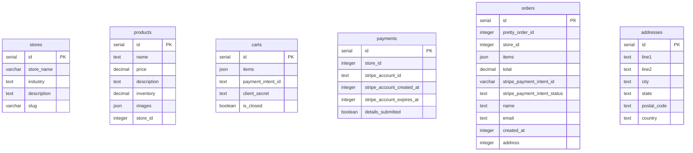

```mermaid
erDiagram
    stores {
        serial id PK
        varchar store_name
        text industry
        text description
        varchar slug
    }
    products {
        serial id PK
        text name
        decimal price
        text description
        decimal inventory
        json images
        integer store_id
    }
    carts {
        serial id PK
        json items
        text payment_intent_id
        text client_secret
        boolean is_closed
    }
    payments {
        serial id PK
        integer store_id
        text stripe_account_id
        integer stripe_account_created_at
        integer stripe_account_expires_at
        boolean details_submitted
    }
    orders {
        serial id PK
        integer pretty_order_id
        integer store_id
        json items
        decimal total
        varchar stripe_payment_intent_id
        text stripe_payment_intent_status
        text name
        text email
        integer created_at
        integer address
    }
    addresses {
        serial id PK
        text line1
        text line2
        text city
        text state
        text postal_code
        text country
    }
```
