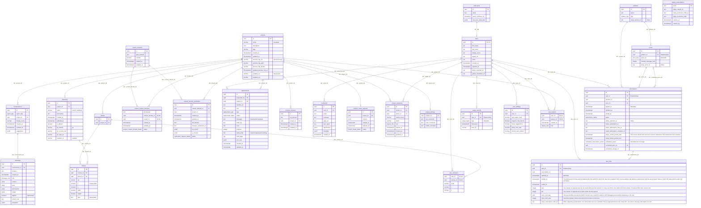

```mermaid
erDiagram
    projects ||--o{ canvas : "(id) - (project_id)"
    canvas ||--o{ frames : "(id) - (canvas_id)"
    branches ||--o{ frames : "(id) - (branch_id)"
    projects ||--o{ conversations : "(id) - (project_id)"
    conversations ||--o{ messages : "(id) - (conversation_id)"
    custom_domains ||--o{ project_custom_domains : "(id) - (custom_domain_id)"
    projects ||--o{ project_custom_domains : "(id) - (project_id)"
    custom_domains ||--o{ custom_domain_verification : "(id) - (custom_domain_id)"
    projects ||--o{ custom_domain_verification : "(id) - (project_id)"
    users ||--o{ deployments : "(id) - (requested_by)"
    projects ||--o{ deployments : "(id) - (project_id)"
    projects |o--o{ preview_domains : "(id) - (project_id)"
    users |o--o{ feedbacks : "(id) - (user_id)"
    projects ||--o| branches : "(id) - (project_id)"
    projects ||--o| project_create_requests : "(id) - (project_id)"
    projects ||--o{ project_invitations : "(id) - (project_id)"
    users ||--o{ project_invitations : "(id) - (inviter_id)"
    projects ||--o| project_settings : "(id) - (project_id)"
    products ||--o{ prices : "(id) - (product_id)"
    users ||--o{ rate_limits : "(id) - (user_id)"
    subscriptions ||--o{ rate_limits : "(id) - (subscription_id)"
    users ||--o{ subscriptions : "(id) - (user_id)"
    products ||--o{ subscriptions : "(id) - (product_id)"
    prices ||--o{ subscriptions : "(id) - (price_id)"
    prices |o--o{ subscriptions : "(id) - (scheduled_price_id)"
    users ||--o{ usage_records : "(id) - (user_id)"
    users ||--o| user_settings : "(id) - (user_id)"
    users ||--o{ user_canvases : "(id) - (user_id)"
    canvas ||--o{ user_canvases : "(id) - (canvas_id)"
    users ||--o{ user_projects : "(id) - (user_id)"
    projects ||--o{ user_projects : "(id) - (project_id)"
    "auth.users" ||--o| users : "(id) - (id)"
    canvas {
        uuid id PK
        uuid project_id FK
    }
    frames {
        uuid id PK
        uuid canvas_id FK
        uuid branch_id FK
        varchar url
        numeric x "display data"
        numeric y
        numeric width
        numeric height
        text type "deprecated"
    }
    conversations {
        uuid id PK
        agent_type agent_type
        uuid project_id FK
        varchar display_name
        timestamptz created_at
        timestamptz updated_at
        jsonb suggestions
    }
    messages {
        uuid id PK
        uuid conversation_id FK
        text content
        timestamptz created_at
        message_role role
        jsonb context
        jsonb parts
        jsonb checkpoints
        jsonb usage
        boolean applied "deprecated"
        text commit_oid
        jsonb snapshots
    }
    custom_domains {
        uuid id PK
        text apex_domain
        boolean verified
        timestamptz created_at
        timestamptz updated_at
    }
    project_custom_domains {
        text full_domain
        uuid custom_domain_id PK, FK
        uuid project_id PK, FK
        timestamptz created_at
        timestamptz updated_at
        project_custom_domain_status status
    }
    custom_domain_verification {
        uuid id PK
        uuid custom_domain_id FK
        uuid project_id FK
        timestamptz created_at
        timestamptz updated_at
        text full_domain
        text freestyle_verification_id
        jsonb txt_record
        jsonb a_records
        verification_request_status status
    }
    deployments {
        uuid id PK
        uuid requested_by FK
        uuid project_id FK
        text sandbox_id
        text urls
        deployment_type type
        deployment_status status
        text message "Deployment progress"
        text build_log
        text error
        integer progress
        text build_script "Custom deployment settings"
        text build_flags
        jsonb env_vars
        timestamptz created_at
        timestamptz updated_at
    }
    preview_domains {
        uuid id PK
        text full_domain
        uuid project_id FK
        timestamptz created_at
        timestamptz updated_at
    }
    feedbacks {
        uuid id PK
        uuid user_id FK
        text email
        text message
        text page_url
        text user_agent
        jsonb attachments
        jsonb metadata
        timestamptz created_at
    }
    branches {
        uuid id PK
        uuid project_id FK
        varchar name "branch metadata"
        text description
        timestamptz created_at
        timestamptz updated_at
        boolean is_default
        varchar git_branch "git"
        varchar git_commit_sha
        varchar git_repo_url
        varchar sandbox_id "sandbox"
    }
    project_create_requests {
        uuid id PK
        uuid project_id FK
        jsonb context
        timestamptz created_at
        timestamptz updated_at
        project_create_status status
    }
    project_invitations {
        uuid id PK
        uuid project_id FK
        uuid inviter_id FK
        varchar invitee_email
        varchar token
        project_role role
        timestamptz expires_at
        timestamptz created_at
        timestamptz updated_at
    }
    projects {
        uuid id PK
        varchar name "metadata"
        text description
        varchar tags
        timestamptz created_at
        timestamptz updated_at
        varchar preview_img_url "preview image"
        varchar preview_img_path
        varchar preview_img_bucket
        timestamptz updated_preview_img_at
        varchar sandbox_id "deprecated"
        varchar sandbox_url
    }
    project_settings {
        uuid project_id FK
        text run_command
        text build_command
        text install_command
    }
    legacy_subscriptions {
        text email PK
        text stripe_coupon_id
        text stripe_promotion_code_id
        text stripe_promotion_code
        timestamptz redeem_at
        timestamptz redeem_by
    }
    prices {
        uuid id PK
        uuid product_id FK "Relationships"
        price_keys price_key "Metadata"
        integer monthly_message_limit
        text stripe_price_id "Stripe"
    }
    products {
        uuid id PK
        text name
        product_type type
        text stripe_product_id "Stripe"
    }
    rate_limits {
        uuid id PK
        uuid user_id FK "Relationships"
        uuid subscription_id FK
        timestamptz updated_at "Metadata"
        timestamptz started_at "The start and end of the rate limit defines the time period for which the rate limit is applied There can be multiple rate limits per subscription and the range doesn't have to match the subscription's start and end dates."
        timestamptz ended_at
        integer max "The number of requests that can be made within the time period. For carry-over limits, this reflects the total number of requests that were carried over."
        integer left "The number of requests left to make within the time period."
        uuid carry_over_key "This key identifies the rate limit that is carried over. Useful for analytics and debugging and possibly displaying to the user."
        integer carry_over_total "Track the number of times this rate limit has been carried over."
        text stripe_subscription_item_id "When upgrading a subscription, the subscription item ID is updated. Due to slight limitations of the Stripe API, we need to track the subscription item ID."
    }
    subscriptions {
        uuid id PK
        uuid user_id FK "Relationships"
        uuid product_id FK
        uuid price_id FK
        timestamptz started_at "Metadata"
        timestamptz updated_at
        timestamptz ended_at
        subscription_status status
        text stripe_customer_id "Stripe"
        text stripe_subscription_id
        text stripe_subscription_item_id
        text stripe_subscription_schedule_id
        timestamptz stripe_current_period_start "The current period start and end is used to determine if the subscription has renewed."
        timestamptz stripe_current_period_end
        scheduled_subscription_action scheduled_action "Scheduled price change"
        uuid scheduled_price_id FK
        timestamptz scheduled_change_at
    }
    usage_records {
        uuid id PK
        uuid user_id FK "Relationships"
        usage_types type "Metadata"
        timestamptz timestamp
        varchar trace_id
    }
    "auth.users" {
        uuid id PK
        text email
        timestamp email_confirmed_at
        jsonb raw_user_meta_data
    }
    user_settings {
        uuid id PK
        uuid user_id FK
        boolean auto_apply_code
        boolean expand_code_blocks
        boolean show_suggestions
        boolean show_mini_chat
        boolean should_warn_delete
    }
    user_canvases {
        uuid user_id PK, FK
        uuid canvas_id PK, FK
        numeric scale
        numeric x
        numeric y
    }
    user_projects {
        uuid user_id PK, FK
        uuid project_id PK, FK
        timestamptz created_at
        project_role role
    }
    users {
        uuid id PK, FK
        text first_name
        text last_name
        text display_name
        text avatar_url
        text email
        timestamptz created_at
        timestamptz updated_at
        text stripe_customer_id
        text github_installation_id
    }
```
