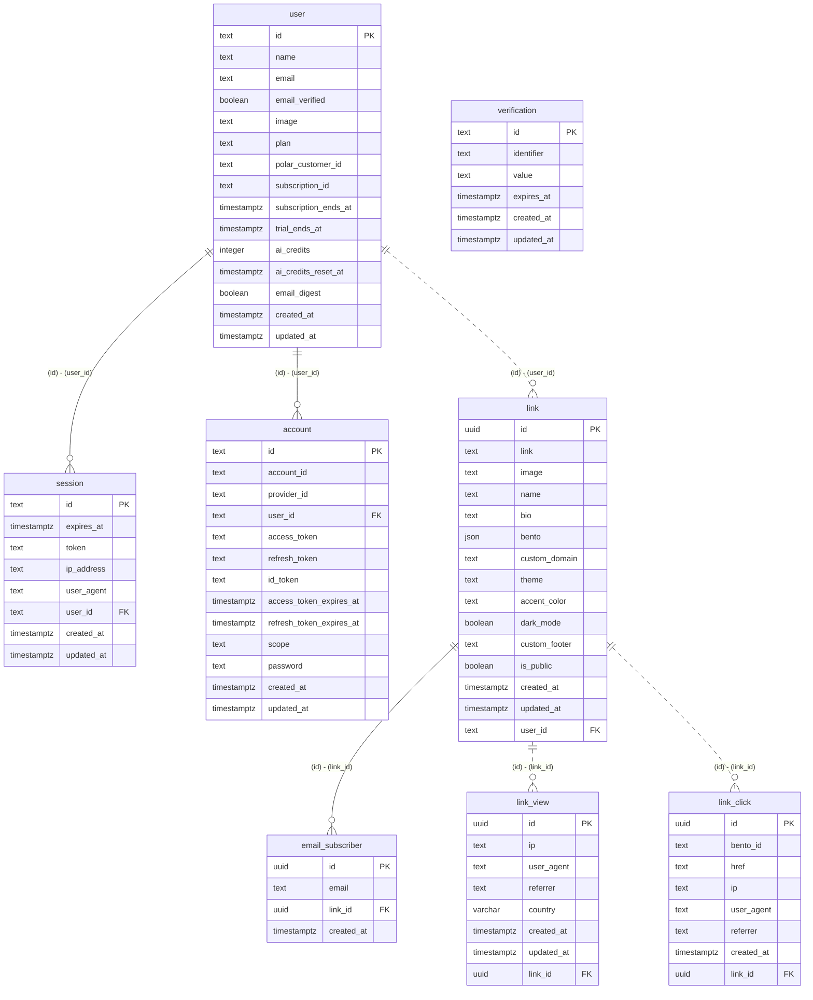

```mermaid
erDiagram
    user ||--o{ session : "(id) - (user_id)"
    user ||--o{ account : "(id) - (user_id)"
    link ||--o{ email_subscriber : "(id) - (link_id)"
    user ||..o{ link : "(id) - (user_id)"
    link ||..o{ link_view : "(id) - (link_id)"
    link ||..o{ link_click : "(id) - (link_id)"
    user {
        text id PK
        text name
        text email
        boolean email_verified
        text image
        text plan
        text polar_customer_id
        text subscription_id
        timestamptz subscription_ends_at
        timestamptz trial_ends_at
        integer ai_credits
        timestamptz ai_credits_reset_at
        boolean email_digest
        timestamptz created_at
        timestamptz updated_at
    }
    session {
        text id PK
        timestamptz expires_at
        text token
        text ip_address
        text user_agent
        text user_id FK
        timestamptz created_at
        timestamptz updated_at
    }
    account {
        text id PK
        text account_id
        text provider_id
        text user_id FK
        text access_token
        text refresh_token
        text id_token
        timestamptz access_token_expires_at
        timestamptz refresh_token_expires_at
        text scope
        text password
        timestamptz created_at
        timestamptz updated_at
    }
    verification {
        text id PK
        text identifier
        text value
        timestamptz expires_at
        timestamptz created_at
        timestamptz updated_at
    }
    link {
        uuid id PK
        text link
        text image
        text name
        text bio
        json bento
        text custom_domain
        text theme
        text accent_color
        boolean dark_mode
        text custom_footer
        boolean is_public
        timestamptz created_at
        timestamptz updated_at
        text user_id FK
    }
    link_view {
        uuid id PK
        text ip
        text user_agent
        text referrer
        varchar country
        timestamptz created_at
        timestamptz updated_at
        uuid link_id FK
    }
    link_click {
        uuid id PK
        text bento_id
        text href
        text ip
        text user_agent
        text referrer
        timestamptz created_at
        uuid link_id FK
    }
    email_subscriber {
        uuid id PK
        text email
        uuid link_id FK
        timestamptz created_at
    }
```
