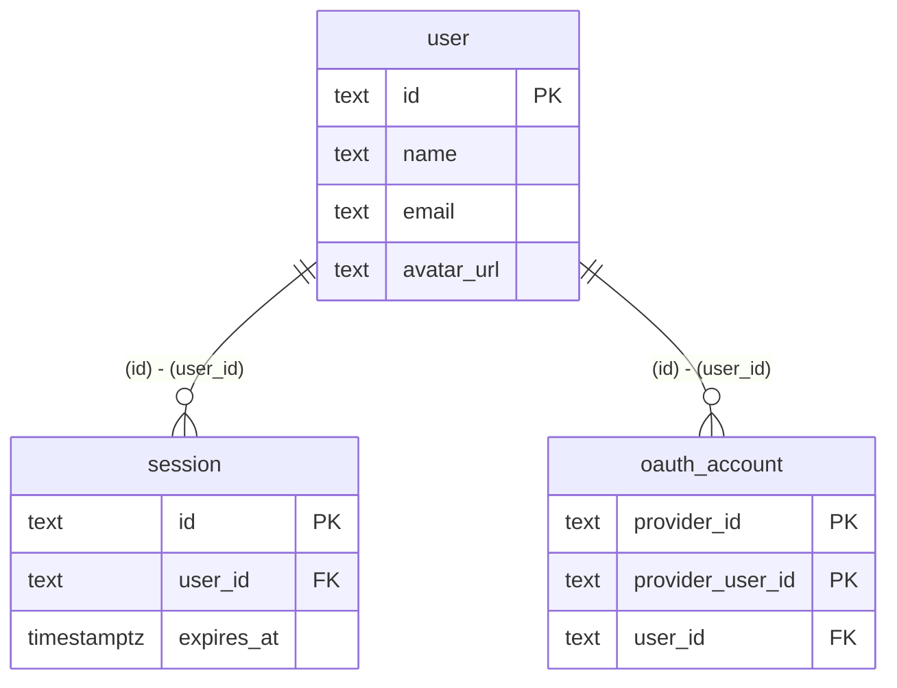

```mermaid
erDiagram
    user ||--o{ session : "(id) - (user_id)"
    user ||--o{ oauth_account : "(id) - (user_id)"
    user {
        text id PK
        text name
        text email
        text avatar_url
    }
    session {
        text id PK
        text user_id FK
        timestamptz expires_at
    }
    oauth_account {
        text provider_id PK
        text provider_user_id PK
        text user_id FK
    }
```
