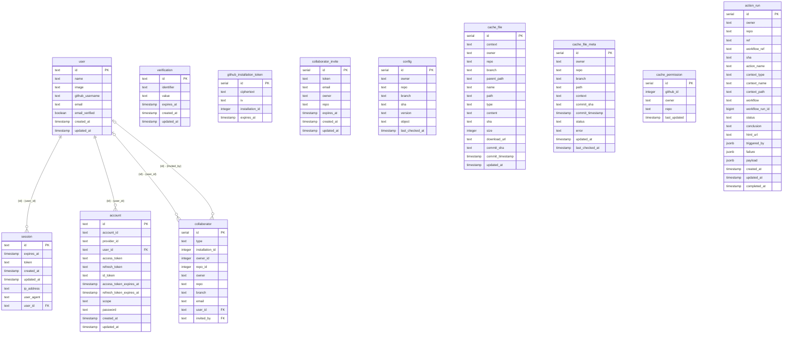

```mermaid
erDiagram
    user ||--o{ session : "(id) - (user_id)"
    user ||--o{ account : "(id) - (user_id)"
    user |o--o{ collaborator : "(id) - (user_id)"
    user |o--o{ collaborator : "(id) - (invited_by)"
    user {
        text id PK
        text name
        text image
        text github_username
        text email
        boolean email_verified
        timestamp created_at
        timestamp updated_at
    }
    session {
        text id PK
        timestamp expires_at
        text token
        timestamp created_at
        timestamp updated_at
        text ip_address
        text user_agent
        text user_id FK
    }
    account {
        text id PK
        text account_id
        text provider_id
        text user_id FK
        text access_token
        text refresh_token
        text id_token
        timestamp access_token_expires_at
        timestamp refresh_token_expires_at
        text scope
        text password
        timestamp created_at
        timestamp updated_at
    }
    verification {
        text id PK
        text identifier
        text value
        timestamp expires_at
        timestamp created_at
        timestamp updated_at
    }
    github_installation_token {
        serial id PK
        text ciphertext
        text iv
        integer installation_id
        timestamp expires_at
    }
    collaborator {
        serial id PK
        text type
        integer installation_id
        integer owner_id
        integer repo_id
        text owner
        text repo
        text branch
        text email
        text user_id FK
        text invited_by FK
    }
    collaborator_invite {
        serial id PK
        text token
        text email
        text owner
        text repo
        timestamp expires_at
        timestamp created_at
        timestamp updated_at
    }
    config {
        serial id PK
        text owner
        text repo
        text branch
        text sha
        text version
        text object
        timestamp last_checked_at
    }
    cache_file {
        serial id PK
        text context
        text owner
        text repo
        text branch
        text parent_path
        text name
        text path
        text type
        text content
        text sha
        integer size
        text download_url
        text commit_sha
        timestamp commit_timestamp
        timestamp updated_at
    }
    cache_file_meta {
        serial id PK
        text owner
        text repo
        text branch
        text path
        text context
        text commit_sha
        timestamp commit_timestamp
        text status
        text error
        timestamp updated_at
        timestamp last_checked_at
    }
    cache_permission {
        serial id PK
        integer github_id
        text owner
        text repo
        timestamp last_updated
    }
    action_run {
        serial id PK
        text owner
        text repo
        text ref
        text workflow_ref
        text sha
        text action_name
        text context_type
        text context_name
        text context_path
        text workflow
        bigint workflow_run_id
        text status
        text conclusion
        text html_url
        jsonb triggered_by
        jsonb failure
        jsonb payload
        timestamp created_at
        timestamp updated_at
        timestamp completed_at
    }
```
