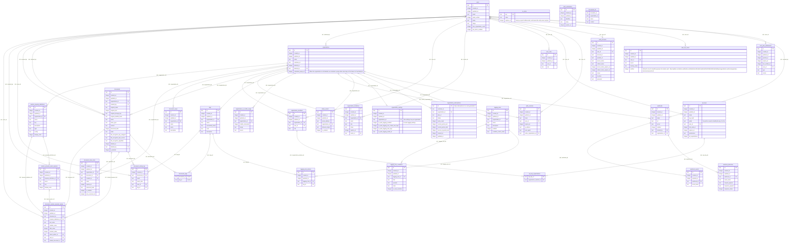

```mermaid
erDiagram
    organizations ||--o{ custom_property_definitions : "(id) - (organization_id)"
    documents ||--o{ document_custom_property_values : "(id) - (document_id)"
    custom_property_definitions ||--o{ document_custom_property_values : "(id) - (property_definition_id)"
    custom_property_select_options |o--o{ document_custom_property_values : "(id) - (select_option_id)"
    users |o--o{ document_custom_property_values : "(id) - (user_id)"
    documents |o--o{ document_custom_property_values : "(id) - (related_document_id)"
    custom_property_definitions ||--o{ custom_property_select_options : "(id) - (property_definition_id)"
    organizations ||--o{ document_share_links : "(id) - (organization_id)"
    documents ||--o{ document_share_links : "(id) - (document_id)"
    users |o--o{ document_share_links : "(id) - (created_by)"
    organizations ||--o{ document_views : "(id) - (organization_id)"
    documents ||--o{ document_activity_log : "(id) - (document_id)"
    users |o--o{ document_activity_log : "(id) - (user_id)"
    tags |o--o{ document_activity_log : "(id) - (tag_id)"
    organizations ||--o{ documents : "(id) - (organization_id)"
    users |o--o{ documents : "(id) - (created_by)"
    users |o--o{ documents : "(id) - (deleted_by)"
    users |o--o{ organizations : "(id) - (deleted_by)"
    organizations ||--o{ organization_members : "(id) - (organization_id)"
    users ||--o{ organization_members : "(id) - (user_id)"
    organizations ||--o{ organization_invitations : "(id) - (organization_id)"
    users ||--o{ organization_invitations : "(id) - (inviter_id)"
    users ||--o{ user_roles : "(id) - (user_id)"
    organizations ||--o{ tags : "(id) - (organization_id)"
    documents ||--o{ documents_tags : "(id) - (document_id)"
    tags ||--o{ documents_tags : "(id) - (tag_id)"
    organizations ||--o{ organization_ai_credits_usage : "(id) - (organization_id)"
    users ||--o{ api_keys : "(id) - (user_id)"
    api_keys ||--o{ api_key_organizations : "(id) - (api_key_id)"
    organization_members ||--o{ api_key_organizations : "(id) - (organization_member_id)"
    users |o--o{ auth_sessions : "(id) - (user_id)"
    organizations |o--o{ auth_sessions : "(id) - (active_organization_id)"
    users |o--o{ auth_accounts : "(id) - (user_id)"
    users |o--o{ auth_two_factor : "(id) - (user_id)"
    organizations ||--o{ intake_emails : "(id) - (organization_id)"
    organizations ||--o| organization_settings : "(id) - (organization_id)"
    users ||--o{ user_plan_entitlements : "(id) - (user_id)"
    organizations ||--o{ organization_subscriptions : "(id) - (organization_id)"
    organizations ||--o{ tagging_rules : "(id) - (organization_id)"
    tagging_rules ||--o{ tagging_rule_conditions : "(id) - (tagging_rule_id)"
    tagging_rules ||--o{ tagging_rule_actions : "(id) - (tagging_rule_id)"
    tags ||--o{ tagging_rule_actions : "(id) - (tag_id)"
    users |o--o{ webhooks : "(id) - (created_by)"
    organizations |o--o{ webhooks : "(id) - (organization_id)"
    webhooks ||--o{ webhook_events : "(id) - (webhook_id)"
    webhooks ||--o{ webhook_deliveries : "(id) - (webhook_id)"
    custom_property_definitions {
        text id PK
        integer created_at
        integer updated_at
        text organization_id FK
        text name
        text key
        text description
        text type
        text config
        integer display_order
    }
    document_custom_property_values {
        text id PK
        integer created_at
        integer updated_at
        text document_id FK
        text property_definition_id FK
        text text_value
        real number_value
        integer date_value
        integer boolean_value
        text select_option_id FK
        text user_id FK
        text related_document_id FK
    }
    custom_property_select_options {
        text id PK
        integer created_at
        integer updated_at
        text property_definition_id FK
        text name
        text key
        integer display_order
    }
    document_share_links {
        text id PK
        integer created_at
        integer updated_at
        text organization_id FK
        text document_id FK
        text created_by FK
        text token
        integer expires_at
        text password_hash
        integer is_enabled
        integer last_accessed_at
    }
    document_views {
        text id PK
        integer created_at
        integer updated_at
        text organization_id FK
        text name
        text query
        text description
    }
    document_activity_log {
        text id PK
        integer created_at
        text document_id FK
        text event
        text event_data
        text user_id FK
        text tag_id FK
    }
    documents {
        text id PK
        integer created_at
        integer updated_at
        text organization_id FK
        text created_by FK
        text original_name
        integer original_size
        text original_storage_key
        text original_sha256_hash
        text name
        text mime_type
        text content
        integer document_date
        text notes
        text file_encryption_key_wrapped
        text file_encryption_kek_version
        text file_encryption_algorithm
        integer deleted_at
        text deleted_by FK
        integer is_deleted
    }
    kv_store {
        text key PK
        text value
        integer expires_at "Expiry as epoch milliseconds; null means the entry never expires."
    }
    organizations {
        text id PK
        integer created_at
        integer updated_at
        text name
        text customer_id
        integer deleted_at
        text deleted_by FK
        integer scheduled_purge_at "When the organization is soft-deleted, we schedule a purge date some days in the future for hard deletion"
    }
    organization_members {
        text id PK
        integer created_at
        integer updated_at
        text organization_id FK
        text user_id FK
        text role
    }
    organization_invitations {
        text id PK
        integer created_at
        integer updated_at
        text organization_id FK
        text email
        text role
        text status
        integer expires_at
        text inviter_id FK
    }
    user_roles {
        text id PK
        integer created_at
        integer updated_at
        text user_id FK
        text role
    }
    tags {
        text id PK
        integer created_at
        integer updated_at
        text organization_id FK
        text name
        text normalized_name
        text color
        text description
    }
    documents_tags {
        text document_id PK, FK
        text tag_id PK, FK
    }
    users {
        text id PK
        integer created_at
        integer updated_at
        text email
        integer email_verified
        text name
        text image
        integer max_organization_count
        integer two_factor_enabled
    }
    organization_ai_credits_usage {
        text id PK
        integer created_at
        integer updated_at
        text organization_id FK
        integer credits_consumed
        text usage
        text source
    }
    api_keys {
        text id PK
        integer created_at
        integer updated_at
        text name
        text key_hash
        text prefix "the prefix is used to identify the key, it is the"
        text user_id FK
        integer last_used_at
        integer expires_at
        text permissions
        integer all_organizations
    }
    api_key_organizations {
        text api_key_id FK
        text organization_member_id FK
    }
    auth_sessions {
        text id PK
        integer created_at
        integer updated_at
        text token
        text user_id FK
        integer expires_at
        text ip_address
        text user_agent
        text active_organization_id FK
    }
    auth_accounts {
        text id PK
        integer created_at
        integer updated_at
        text user_id FK
        text account_id
        text provider_id
        text access_token
        text refresh_token
        integer access_token_expires_at
        integer refresh_token_expires_at
        text scope
        text id_token
        text password
    }
    auth_verifications {
        text id PK
        integer created_at
        integer updated_at
        text identifier
        text value
        integer expires_at
    }
    auth_two_factor {
        text id PK
        integer created_at
        integer updated_at
        text user_id FK
        text secret
        text backup_codes
        integer verified "Default to true for backfill purposes from better auth : https://github.com/better-auth/better-auth/blob/4cbc823e694c1adb10ef26cf8294263453a156d3/packages/better-auth/src/plugins/two-factor/schema.ts#L42"
    }
    documents_fts {
        text document_id
        text organization_id
        text name
        text content
    }
    intake_emails {
        text id PK
        integer created_at
        integer updated_at
        text email_address
        text organization_id FK
        text allowed_origins
        integer is_enabled
    }
    organization_settings {
        text id PK
        integer created_at
        integer updated_at
        text organization_id FK "One settings row per organization"
        integer ai_auto_tagging_enabled "AI auto-tagging settings"
        integer ai_auto_tagging_can_create_new_tags
        integer ai_auto_tagging_max_tags
        text ai_auto_tagging_model_id
    }
    user_plan_entitlements {
        text id PK
        integer created_at
        integer updated_at
        integer granted_at
        integer expires_at
        integer last_verified_at
        text user_id FK
        text type
        text source
    }
    organization_subscriptions {
        text id PK "stripe subscription id, no auto-generated id"
        text customer_id
        text organization_id FK
        text plan_id
        text status
        integer seats_count
        integer current_period_end
        integer current_period_start
        integer cancel_at_period_end
        integer created_at
        integer updated_at
    }
    tagging_rules {
        text id PK
        integer created_at
        integer updated_at
        text organization_id FK
        text name
        text description
        integer enabled
        text condition_match_mode
    }
    tagging_rule_conditions {
        text id PK
        integer created_at
        integer updated_at
        text tagging_rule_id FK
        text field
        text operator
        text value
        integer is_case_sensitive
    }
    tagging_rule_actions {
        text id PK
        integer created_at
        integer updated_at
        text tagging_rule_id FK
        text tag_id FK
    }
    webhooks {
        text id PK
        integer created_at
        integer updated_at
        text name
        text url
        text secret
        integer enabled
        text created_by FK
        text organization_id FK
    }
    webhook_events {
        text id PK
        integer created_at
        integer updated_at
        text webhook_id FK
        text event_name
    }
    webhook_deliveries {
        text id PK
        integer created_at
        integer updated_at
        text webhook_id FK
        text event_name
        text request_payload
        text response_payload
        integer response_status
    }
```
