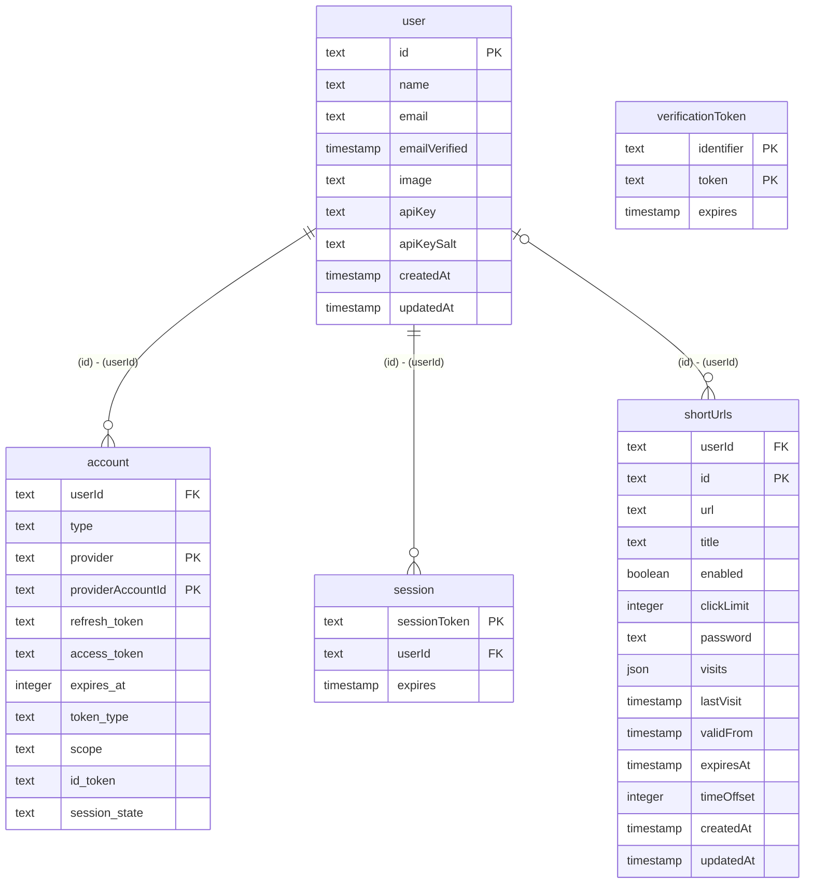

```mermaid
erDiagram
    user ||--o{ account : "(id) - (userId)"
    user ||--o{ session : "(id) - (userId)"
    user |o--o{ shortUrls : "(id) - (userId)"
    user {
        text id PK
        text name
        text email
        timestamp emailVerified
        text image
        text apiKey
        text apiKeySalt
        timestamp createdAt
        timestamp updatedAt
    }
    account {
        text userId FK
        text type
        text provider PK
        text providerAccountId PK
        text refresh_token
        text access_token
        integer expires_at
        text token_type
        text scope
        text id_token
        text session_state
    }
    session {
        text sessionToken PK
        text userId FK
        timestamp expires
    }
    verificationToken {
        text identifier PK
        text token PK
        timestamp expires
    }
    shortUrls {
        text userId FK
        text id PK
        text url
        text title
        boolean enabled
        integer clickLimit
        text password
        json visits
        timestamp lastVisit
        timestamp validFrom
        timestamp expiresAt
        integer timeOffset
        timestamp createdAt
        timestamp updatedAt
    }
```
