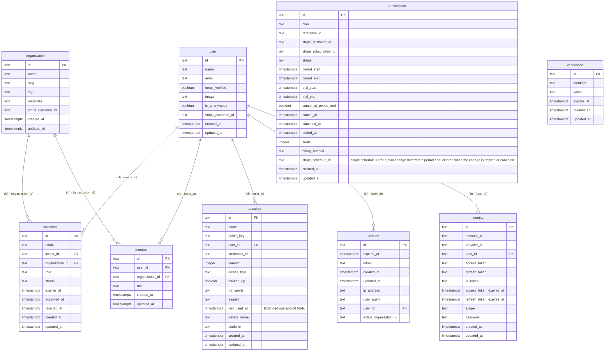

```mermaid
erDiagram
    user ||--o{ invitation : "(id) - (inviter_id)"
    organization ||--o{ invitation : "(id) - (organization_id)"
    user ||--o{ member : "(id) - (user_id)"
    organization ||--o{ member : "(id) - (organization_id)"
    user ||--o{ passkey : "(id) - (user_id)"
    user ||--o{ session : "(id) - (user_id)"
    user ||--o{ identity : "(id) - (user_id)"
    invitation {
        text id PK
        text email
        text inviter_id FK
        text organization_id FK
        text role
        text status
        timestamptz expires_at
        timestamptz accepted_at
        timestamptz rejected_at
        timestamptz created_at
        timestamptz updated_at
    }
    organization {
        text id PK
        text name
        text slug
        text logo
        text metadata
        text stripe_customer_id
        timestamptz created_at
        timestamptz updated_at
    }
    member {
        text id PK
        text user_id FK
        text organization_id FK
        text role
        timestamptz created_at
        timestamptz updated_at
    }
    passkey {
        text id PK
        text name
        text public_key
        text user_id FK
        text credential_id
        integer counter
        text device_type
        boolean backed_up
        text transports
        text aaguid
        timestamptz last_used_at "Extended operational fields"
        text device_name
        text platform
        timestamptz created_at
        timestamptz updated_at
    }
    subscription {
        text id PK
        text plan
        text reference_id
        text stripe_customer_id
        text stripe_subscription_id
        text status
        timestamptz period_start
        timestamptz period_end
        timestamptz trial_start
        timestamptz trial_end
        boolean cancel_at_period_end
        timestamptz cancel_at
        timestamptz canceled_at
        timestamptz ended_at
        integer seats
        text billing_interval
        text stripe_schedule_id "Stripe schedule ID for a plan change deferred to period end; cleared when the change is applied or canceled."
        timestamptz created_at
        timestamptz updated_at
    }
    user {
        text id PK
        text name
        text email
        boolean email_verified
        text image
        boolean is_anonymous
        text stripe_customer_id
        timestamptz created_at
        timestamptz updated_at
    }
    session {
        text id PK
        timestamptz expires_at
        text token
        timestamptz created_at
        timestamptz updated_at
        text ip_address
        text user_agent
        text user_id FK
        text active_organization_id
    }
    identity {
        text id PK
        text account_id
        text provider_id
        text user_id FK
        text access_token
        text refresh_token
        text id_token
        timestamptz access_token_expires_at
        timestamptz refresh_token_expires_at
        text scope
        text password
        timestamptz created_at
        timestamptz updated_at
    }
    verification {
        text id PK
        text identifier
        text value
        timestamptz expires_at
        timestamptz created_at
        timestamptz updated_at
    }
```
