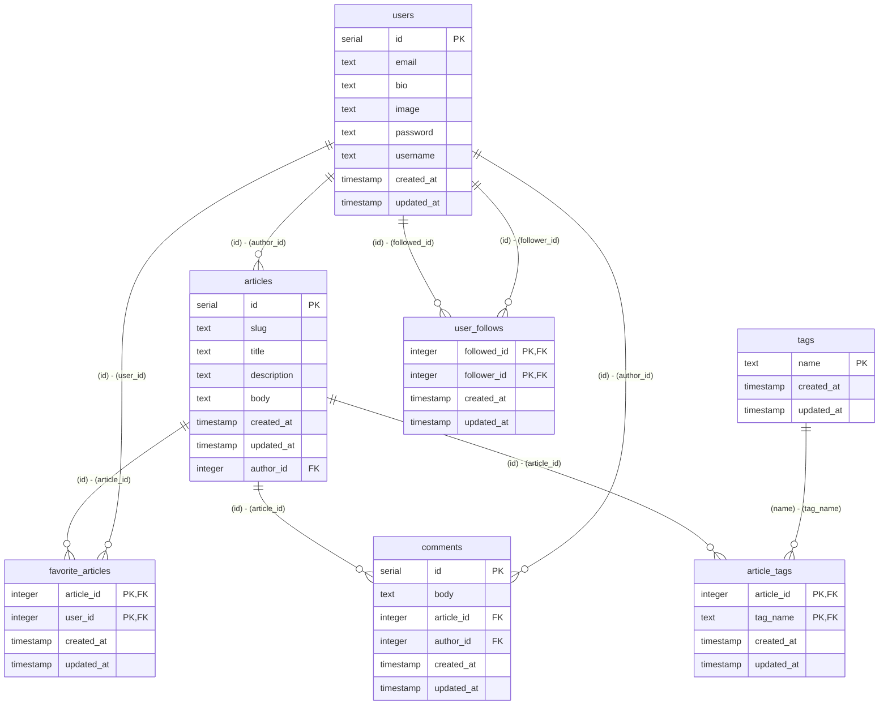

```mermaid
erDiagram
    users ||--o{ articles : "(id) - (author_id)"
    articles ||--o{ favorite_articles : "(id) - (article_id)"
    users ||--o{ favorite_articles : "(id) - (user_id)"
    articles ||--o{ comments : "(id) - (article_id)"
    users ||--o{ comments : "(id) - (author_id)"
    articles ||--o{ article_tags : "(id) - (article_id)"
    tags ||--o{ article_tags : "(name) - (tag_name)"
    users ||--o{ user_follows : "(id) - (followed_id)"
    users ||--o{ user_follows : "(id) - (follower_id)"
    articles {
        serial id PK
        text slug
        text title
        text description
        text body
        timestamp created_at
        timestamp updated_at
        integer author_id FK
    }
    favorite_articles {
        integer article_id PK, FK
        integer user_id PK, FK
        timestamp created_at
        timestamp updated_at
    }
    comments {
        serial id PK
        text body
        integer article_id FK
        integer author_id FK
        timestamp created_at
        timestamp updated_at
    }
    tags {
        text name PK
        timestamp created_at
        timestamp updated_at
    }
    article_tags {
        integer article_id PK, FK
        text tag_name PK, FK
        timestamp created_at
        timestamp updated_at
    }
    users {
        serial id PK
        text email
        text bio
        text image
        text password
        text username
        timestamp created_at
        timestamp updated_at
    }
    user_follows {
        integer followed_id PK, FK
        integer follower_id PK, FK
        timestamp created_at
        timestamp updated_at
    }
```
