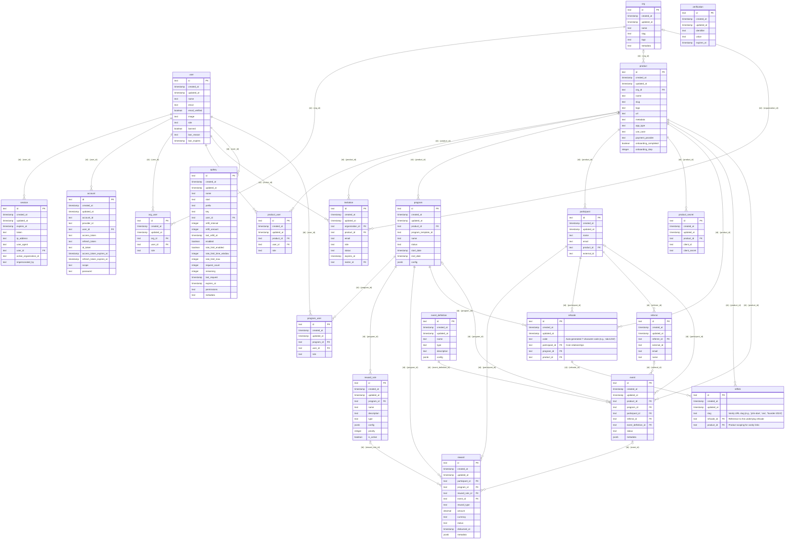

```mermaid
erDiagram
    user ||--o{ session : "(id) - (user_id)"
    user ||--o{ account : "(id) - (user_id)"
    org ||--o{ org_user : "(id) - (org_id)"
    user ||--o{ org_user : "(id) - (user_id)"
    org |o--o{ product : "(id) - (org_id)"
    product ||--o{ product_user : "(id) - (product_id)"
    user ||--o{ product_user : "(id) - (user_id)"
    org |o--o{ invitation : "(id) - (organization_id)"
    product |o--o{ invitation : "(id) - (product_id)"
    user ||--o{ invitation : "(id) - (inviter_id)"
    user ||--o{ apikey : "(id) - (user_id)"
    product ||--o{ program : "(id) - (product_id)"
    program ||--o{ program_user : "(id) - (program_id)"
    user ||--o{ program_user : "(id) - (user_id)"
    product ||--o{ participant : "(id) - (product_id)"
    program ||--o{ reward_rule : "(id) - (program_id)"
    participant ||--o{ reward : "(id) - (participant_id)"
    program ||--o{ reward : "(id) - (program_id)"
    reward_rule |o--o{ reward : "(id) - (reward_rule_id)"
    event |o--o{ reward : "(id) - (event_id)"
    product ||--o{ product_secret : "(id) - (product_id)"
    participant ||--o{ refcode : "(id) - (participant_id)"
    program ||--o{ refcode : "(id) - (program_id)"
    product ||--o{ refcode : "(id) - (product_id)"
    refcode ||--o{ reflink : "(id) - (refcode_id)"
    product ||--o{ reflink : "(id) - (product_id)"
    participant ||--o{ referral : "(id) - (referrer_id)"
    product ||--o{ event : "(id) - (product_id)"
    program |o--o{ event : "(id) - (program_id)"
    participant |o--o{ event : "(id) - (participant_id)"
    referral |o--o{ event : "(id) - (referral_id)"
    event_definition ||--o{ event : "(id) - (event_definition_id)"
    user {
        text id PK
        timestamp created_at
        timestamp updated_at
        text name
        text email
        boolean email_verified
        text image
        text role
        boolean banned
        text ban_reason
        timestamp ban_expires
    }
    session {
        text id PK
        timestamp created_at
        timestamp updated_at
        timestamp expires_at
        text token
        text ip_address
        text user_agent
        text user_id FK
        text active_organization_id
        text impersonated_by
    }
    account {
        text id PK
        timestamp created_at
        timestamp updated_at
        text account_id
        text provider_id
        text user_id FK
        text access_token
        text refresh_token
        text id_token
        timestamp access_token_expires_at
        timestamp refresh_token_expires_at
        text scope
        text password
    }
    verification {
        text id PK
        timestamp created_at
        timestamp updated_at
        text identifier
        text value
        timestamp expires_at
    }
    org {
        text id PK
        timestamp created_at
        timestamp updated_at
        text name
        text slug
        text logo
        text metadata
    }
    org_user {
        text id PK
        timestamp created_at
        timestamp updated_at
        text org_id FK
        text user_id FK
        text role
    }
    product {
        text id PK
        timestamp created_at
        timestamp updated_at
        text org_id FK
        text name
        text slug
        text logo
        text url
        text metadata
        text app_type
        text use_case
        text payment_provider
        boolean onboarding_completed
        integer onboarding_step
    }
    product_user {
        text id PK
        timestamp created_at
        timestamp updated_at
        text product_id FK
        text user_id FK
        text role
    }
    invitation {
        text id PK
        timestamp created_at
        timestamp updated_at
        text organization_id FK
        text product_id FK
        text email
        text role
        text status
        timestamp expires_at
        text inviter_id FK
    }
    apikey {
        text id PK
        timestamp created_at
        timestamp updated_at
        text name
        text start
        text prefix
        text key
        text user_id FK
        integer refill_interval
        integer refill_amount
        timestamp last_refill_at
        boolean enabled
        boolean rate_limit_enabled
        integer rate_limit_time_window
        integer rate_limit_max
        integer request_count
        integer remaining
        timestamp last_request
        timestamp expires_at
        text permissions
        text metadata
    }
    program {
        text id PK
        timestamp created_at
        timestamp updated_at
        text product_id FK
        text program_template_id
        text name
        text status
        timestamp start_date
        timestamp end_date
        jsonb config
    }
    program_user {
        text id PK
        timestamp created_at
        timestamp updated_at
        text program_id FK
        text user_id FK
        text role
    }
    event_definition {
        text id PK
        timestamp created_at
        timestamp updated_at
        text name
        text type
        text description
        jsonb config
    }
    participant {
        text id PK
        timestamp created_at
        timestamp updated_at
        text name
        text email
        text product_id FK
        text external_id
    }
    reward_rule {
        text id PK
        timestamp created_at
        timestamp updated_at
        text program_id FK
        text name
        text description
        text type
        jsonb config
        integer priority
        boolean is_active
    }
    reward {
        text id PK
        timestamp created_at
        timestamp updated_at
        text participant_id FK
        text program_id FK
        text reward_rule_id FK
        text event_id FK
        text reward_type
        decimal amount
        text currency
        text status
        timestamp disbursed_at
        jsonb metadata
    }
    product_secret {
        text id PK
        timestamp created_at
        timestamp updated_at
        text product_id FK
        text client_id
        text client_secret
    }
    refcode {
        text id PK
        timestamp created_at
        timestamp updated_at
        text code "Auto-generated 7-character code (e.g., 'abc1234')"
        text participant_id FK "Core relationships"
        text program_id FK
        text product_id FK
    }
    reflink {
        text id PK
        timestamp created_at
        timestamp updated_at
        text slug "Vanity URL slug (e.g., 'john-doe', 'ceo', 'founder-2024')"
        text refcode_id FK "Reference to the underlying refcode"
        text product_id FK "Product scoping for vanity links"
    }
    referral {
        text id PK
        timestamp created_at
        timestamp updated_at
        text referrer_id FK
        text external_id
        text email
        text name
    }
    event {
        text id PK
        timestamp created_at
        timestamp updated_at
        text product_id FK
        text program_id FK
        text participant_id FK
        text referral_id FK
        text event_definition_id FK
        text status
        jsonb metadata
    }
```
