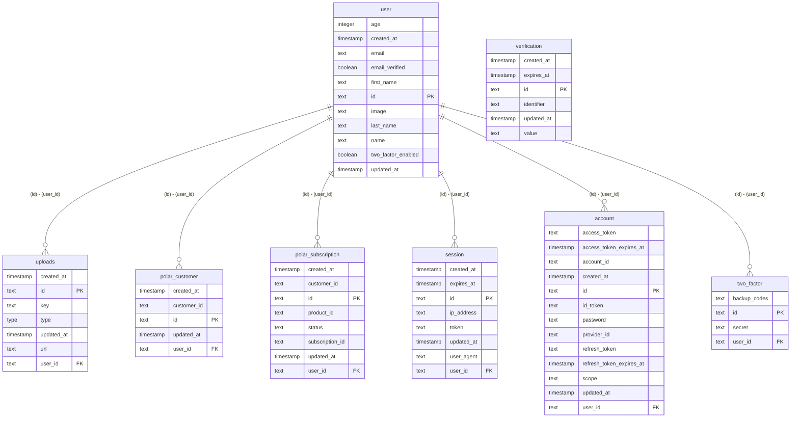

```mermaid
erDiagram
    user ||--o{ uploads : "(id) - (user_id)"
    user ||--o{ polar_customer : "(id) - (user_id)"
    user ||--o{ polar_subscription : "(id) - (user_id)"
    user ||--o{ session : "(id) - (user_id)"
    user ||--o{ account : "(id) - (user_id)"
    user ||--o{ two_factor : "(id) - (user_id)"
    uploads {
        timestamp created_at
        text id PK
        text key
        type type
        timestamp updated_at
        text url
        text user_id FK
    }
    polar_customer {
        timestamp created_at
        text customer_id
        text id PK
        timestamp updated_at
        text user_id FK
    }
    polar_subscription {
        timestamp created_at
        text customer_id
        text id PK
        text product_id
        text status
        text subscription_id
        timestamp updated_at
        text user_id FK
    }
    user {
        integer age
        timestamp created_at
        text email
        boolean email_verified
        text first_name
        text id PK
        text image
        text last_name
        text name
        boolean two_factor_enabled
        timestamp updated_at
    }
    session {
        timestamp created_at
        timestamp expires_at
        text id PK
        text ip_address
        text token
        timestamp updated_at
        text user_agent
        text user_id FK
    }
    account {
        text access_token
        timestamp access_token_expires_at
        text account_id
        timestamp created_at
        text id PK
        text id_token
        text password
        text provider_id
        text refresh_token
        timestamp refresh_token_expires_at
        text scope
        timestamp updated_at
        text user_id FK
    }
    verification {
        timestamp created_at
        timestamp expires_at
        text id PK
        text identifier
        timestamp updated_at
        text value
    }
    two_factor {
        text backup_codes
        text id PK
        text secret
        text user_id FK
    }
```
