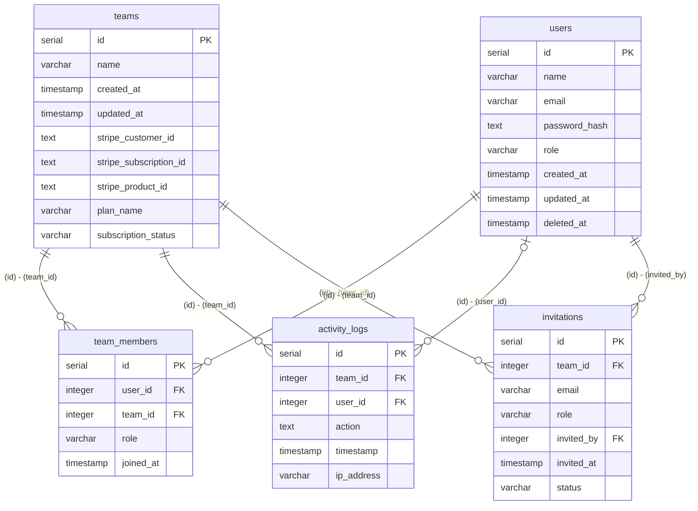

```mermaid
erDiagram
    users ||--o{ team_members : "(id) - (user_id)"
    teams ||--o{ team_members : "(id) - (team_id)"
    teams ||--o{ activity_logs : "(id) - (team_id)"
    users |o--o{ activity_logs : "(id) - (user_id)"
    teams ||--o{ invitations : "(id) - (team_id)"
    users ||--o{ invitations : "(id) - (invited_by)"
    users {
        serial id PK
        varchar name
        varchar email
        text password_hash
        varchar role
        timestamp created_at
        timestamp updated_at
        timestamp deleted_at
    }
    teams {
        serial id PK
        varchar name
        timestamp created_at
        timestamp updated_at
        text stripe_customer_id
        text stripe_subscription_id
        text stripe_product_id
        varchar plan_name
        varchar subscription_status
    }
    team_members {
        serial id PK
        integer user_id FK
        integer team_id FK
        varchar role
        timestamp joined_at
    }
    activity_logs {
        serial id PK
        integer team_id FK
        integer user_id FK
        text action
        timestamp timestamp
        varchar ip_address
    }
    invitations {
        serial id PK
        integer team_id FK
        varchar email
        varchar role
        integer invited_by FK
        timestamp invited_at
        varchar status
    }
```
