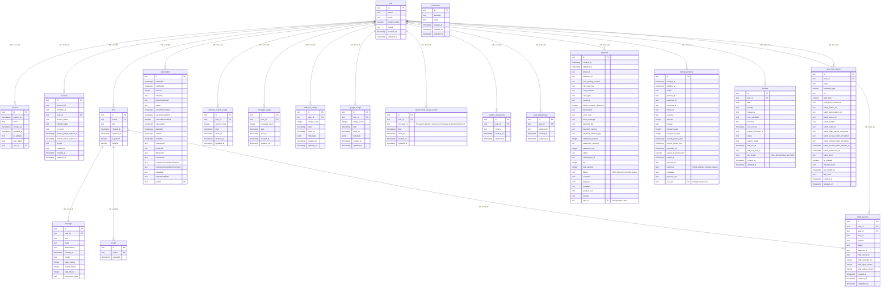

```mermaid
erDiagram
    user ||--o{ session : "(id) - (user_id)"
    user ||--o{ account : "(id) - (user_id)"
    user ||--o{ chat : "(id) - (userId)"
    chat ||--o{ message : "(id) - (chat_id)"
    chat ||--o{ stream : "(id) - (chatId)"
    user |o--o{ subscription : "(id) - (userId)"
    user ||--o{ extreme_search_usage : "(id) - (user_id)"
    user ||--o{ message_usage : "(id) - (user_id)"
    user ||--o{ anthropic_usage : "(id) - (user_id)"
    user ||--o{ google_usage : "(id) - (user_id)"
    user ||--o{ agent_mode_usage_events : "(id) - (user_id)"
    user ||--o{ custom_instructions : "(id) - (user_id)"
    user ||--o| user_preferences : "(id) - (user_id)"
    user |o--o{ payment : "(id) - (user_id)"
    user |o--o{ dodosubscription : "(id) - (user_id)"
    user ||--o{ lookout : "(id) - (user_id)"
    user ||--o{ user_mcp_server : "(id) - (user_id)"
    chat ||--o{ build_session : "(id) - (chat_id)"
    user ||--o{ build_session : "(id) - (user_id)"
    user {
        text id PK
        text name
        text email
        boolean email_verified
        text image
        timestamp created_at
        timestamp updated_at
    }
    session {
        text id PK
        timestamp expires_at
        text token
        timestamp created_at
        timestamp updated_at
        text ip_address
        text user_agent
        text user_id FK
    }
    account {
        text id PK
        text account_id
        text provider_id
        text user_id FK
        text access_token
        text refresh_token
        text id_token
        timestamp access_token_expires_at
        timestamp refresh_token_expires_at
        text scope
        text password
        timestamp created_at
        timestamp updated_at
    }
    verification {
        text id PK
        text identifier
        text value
        timestamp expires_at
        timestamp created_at
        timestamp updated_at
    }
    chat {
        text id PK
        text userId FK
        text title
        timestamp created_at
        timestamp updated_at
        boolean is_pinned
        varchar visibility
    }
    message {
        text id PK
        text chat_id FK
        text role
        json parts
        json attachments
        timestamp created_at
        text model
        integer input_tokens
        integer output_tokens
        integer total_tokens
        real completion_time
    }
    stream {
        text id PK
        text chatId FK
        timestamp createdAt
    }
    subscription {
        text id PK
        timestamp createdAt
        timestamp modifiedAt
        integer amount
        text currency
        text recurringInterval
        text status
        timestamp currentPeriodStart
        timestamp currentPeriodEnd
        boolean cancelAtPeriodEnd
        timestamp canceledAt
        timestamp startedAt
        timestamp endsAt
        timestamp endedAt
        text customerId
        text productId
        text discountId
        text checkoutId
        text customerCancellationReason
        text customerCancellationComment
        text metadata
        text customFieldData
        text userId FK
    }
    extreme_search_usage {
        text id PK
        text user_id FK
        integer search_count
        timestamp date
        timestamp reset_at
        timestamp created_at
        timestamp updated_at
    }
    message_usage {
        text id PK
        text user_id FK
        integer message_count
        timestamp date
        timestamp reset_at
        timestamp created_at
        timestamp updated_at
    }
    anthropic_usage {
        text id PK
        text user_id FK
        integer usage_count
        timestamp date
        timestamp reset_at
        jsonb metadata
        timestamp created_at
        timestamp updated_at
    }
    google_usage {
        text id PK
        text user_id FK
        integer usage_count
        timestamp date
        timestamp reset_at
        jsonb metadata
        timestamp created_at
        timestamp updated_at
    }
    agent_mode_usage_events {
        text id PK
        text user_id FK
        text message_id "The agent request's latest user message id (idempotency key)."
        timestamp date
        timestamp reset_at
        timestamp created_at
        timestamp updated_at
    }
    custom_instructions {
        text id PK
        text user_id FK
        text content
        timestamp created_at
        timestamp updated_at
    }
    user_preferences {
        text id PK
        text user_id FK
        json preferences
        timestamp created_at
        timestamp updated_at
    }
    payment {
        text id PK
        timestamp created_at
        timestamp updated_at
        text brand_id
        text business_id
        text card_issuing_country
        text card_last_four
        text card_network
        text card_type
        text currency
        boolean digital_products_delivered
        text discount_id
        text error_code
        text error_message
        text payment_link
        text payment_method
        text payment_method_type
        integer settlement_amount
        text settlement_currency
        integer settlement_tax
        text status
        text subscription_id
        integer tax
        integer total_amount
        json billing "JSON fields for complex objects"
        json customer
        json disputes
        json metadata
        json product_cart
        json refunds
        text user_id FK "Foreign key to user"
    }
    dodosubscription {
        text id PK
        timestamp created_at
        timestamp updated_at
        text status
        text product_id
        text customer_id
        text business_id
        text brand_id
        text currency
        integer amount
        text interval
        integer interval_count
        integer trial_period_days
        timestamp current_period_start
        timestamp current_period_end
        timestamp cancelled_at
        boolean cancel_at_period_end
        timestamp ended_at
        text discount_id
        json customer "JSON fields for complex objects"
        json metadata
        json product_cart
        text user_id FK "Foreign key to user"
    }
    lookout {
        text id PK
        text user_id FK
        text title
        text prompt
        text frequency
        text cron_schedule
        text timezone
        timestamp next_run_at
        text qstash_schedule_id
        text status
        text search_mode
        timestamp last_run_at
        text last_run_chat_id
        json run_history "Store all run history as JSON"
        timestamp created_at
        timestamp updated_at
    }
    user_mcp_server {
        text id PK
        text user_id FK
        text name
        varchar transport_type
        text url
        varchar auth_type
        text encrypted_credentials
        text oauth_issuer_url
        text oauth_authorization_url
        text oauth_token_url
        text oauth_scopes
        text oauth_client_id
        text oauth_client_secret_encrypted
        text oauth_access_token_encrypted
        text oauth_refresh_token_encrypted
        timestamp oauth_access_token_expires_at
        timestamp oauth_connected_at
        text oauth_error
        boolean is_enabled
        json disabled_tools
        timestamp last_tested_at
        text last_error
        timestamp created_at
        timestamp updated_at
    }
    build_session {
        text id PK
        text chat_id FK
        text user_id FK
        text box_id
        text runtime
        text status
        text snapshot_id
        real total_cost_usd
        integer total_compute_ms
        integer total_input_tokens
        integer total_output_tokens
        timestamp created_at
        timestamp updated_at
        timestamp completed_at
    }
```
