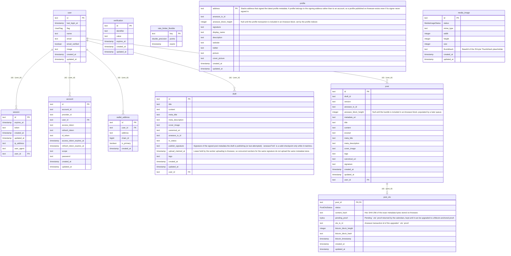

```mermaid
erDiagram
    user ||--o{ session : "(id) - (user_id)"
    user ||--o{ account : "(id) - (user_id)"
    user ||--o{ wallet_address : "(id) - (user_id)"
    user ||--o{ draft : "(id) - (user_id)"
    user ||--o{ post : "(id) - (user_id)"
    post ||--o| post_ots : "(id) - (post_id)"
    user {
        text id PK
        timestamp last_login_at
        UserFlag flag
        text name
        text email
        boolean email_verified
        text image
        timestamp created_at
        timestamp updated_at
    }
    session {
        text id PK
        timestamp expires_at
        text token
        timestamp created_at
        timestamp updated_at
        text ip_address
        text user_agent
        text user_id FK
    }
    account {
        text id PK
        text account_id
        text provider_id
        text user_id FK
        text access_token
        text refresh_token
        text id_token
        timestamp access_token_expires_at
        timestamp refresh_token_expires_at
        text scope
        text password
        timestamp created_at
        timestamp updated_at
    }
    verification {
        text id PK
        text identifier
        text value
        timestamp expires_at
        timestamp created_at
        timestamp updated_at
    }
    wallet_address {
        text id PK
        text user_id FK
        text address
        bigint chain_id
        boolean is_primary
        timestamp created_at
    }
    rate_limiter_flexible {
        text key PK
        double_precision points
        timestamp expire
    }
    draft {
        text id PK
        text title
        text content
        text meta_title
        text meta_description
        text cover_image
        text canonical_uri
        text arweave_tx_id
        text tx_status
        text publish_signature "Signature of the signed post metadata the draft is publishing (or last attempted). `arweaveTxId` is a valid checkpoint only while it matches."
        timestamp upload_claimed_at "Lease held by the worker uploading to Arweave, so concurrent workers for the same signature do not upload the same metadata twice."
        text tags
        timestamp created_at
        timestamp updated_at
        text user_id FK
    }
    profile {
        text address PK "Stacks address that signed the latest profile metadata. A profile belongs to the signing address rather than to an account, so a profile published on Arweave exists even if its signer never signed in."
        text arweave_tx_id
        integer arweave_block_height "Null until the profile transaction is included in an Arweave block; set by the profile indexer."
        text signature
        text display_name
        text description
        text website
        text twitter
        text picture
        text cover_picture
        timestamp created_at
        timestamp updated_at
    }
    media_image {
        text id PK
        MediaImageStatus status
        text mime_type
        integer width
        integer height
        integer size
        text thumbhash "Base64 of the 25-byte ThumbHash placeholder."
        timestamp created_at
        timestamp updated_at
    }
    post {
        text id PK
        text draft_id
        text version
        text arweave_tx_id
        integer arweave_block_height "Null until the bundle is included in an Arweave block; populated by a later queue."
        text metadata_uri
        text title
        text content
        text excerpt
        text meta_title
        text meta_description
        text cover_image
        text tags
        text canonical_uri
        text signature
        timestamp created_at
        timestamp updated_at
        text user_id FK
    }
    post_ots {
        text post_id PK, FK
        PostOtsStatus status
        text content_hash "Hex SHA-256 of the exact metadata bytes stored on Arweave."
        bytea pending_proof "Pending `.ots` proof returned by the calendars, kept until it can be upgraded to a Bitcoin-anchored proof."
        text ots_tx_id "Arweave transaction id of the upgraded `.ots` proof."
        integer bitcoin_block_height
        text bitcoin_block_hash
        timestamp bitcoin_timestamp
        timestamp created_at
        timestamp updated_at
    }
```
