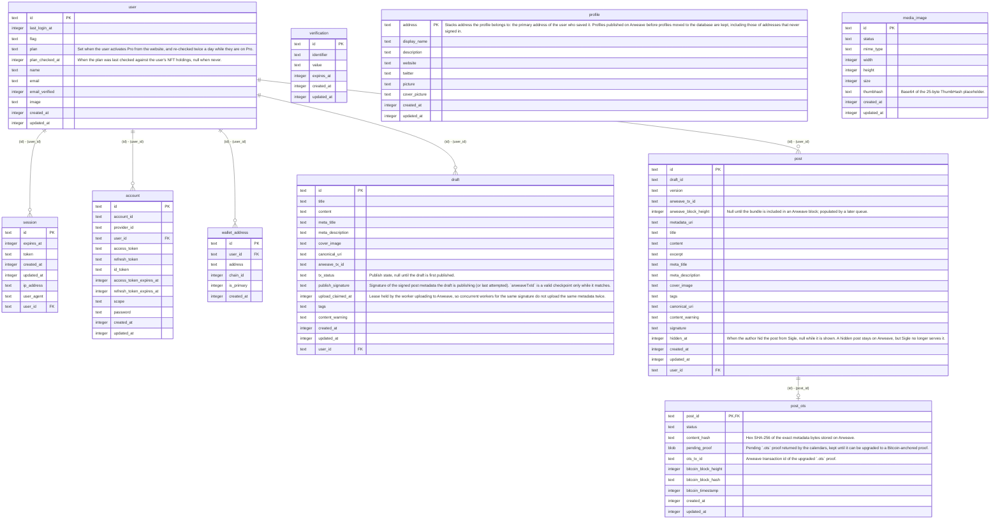

```mermaid
erDiagram
    user ||--o{ session : "(id) - (user_id)"
    user ||--o{ account : "(id) - (user_id)"
    user ||--o{ wallet_address : "(id) - (user_id)"
    user ||--o{ draft : "(id) - (user_id)"
    user ||--o{ post : "(id) - (user_id)"
    post ||--o| post_ots : "(id) - (post_id)"
    user {
        text id PK
        integer last_login_at
        text flag
        text plan "Set when the user activates Pro from the website, and re-checked twice a day while they are on Pro."
        integer plan_checked_at "When the plan was last checked against the user's NFT holdings, null when never."
        text name
        text email
        integer email_verified
        text image
        integer created_at
        integer updated_at
    }
    session {
        text id PK
        integer expires_at
        text token
        integer created_at
        integer updated_at
        text ip_address
        text user_agent
        text user_id FK
    }
    account {
        text id PK
        text account_id
        text provider_id
        text user_id FK
        text access_token
        text refresh_token
        text id_token
        integer access_token_expires_at
        integer refresh_token_expires_at
        text scope
        text password
        integer created_at
        integer updated_at
    }
    verification {
        text id PK
        text identifier
        text value
        integer expires_at
        integer created_at
        integer updated_at
    }
    wallet_address {
        text id PK
        text user_id FK
        text address
        integer chain_id
        integer is_primary
        integer created_at
    }
    draft {
        text id PK
        text title
        text content
        text meta_title
        text meta_description
        text cover_image
        text canonical_uri
        text arweave_tx_id
        text tx_status "Publish state, null until the draft is first published."
        text publish_signature "Signature of the signed post metadata the draft is publishing (or last attempted). `arweaveTxId` is a valid checkpoint only while it matches."
        integer upload_claimed_at "Lease held by the worker uploading to Arweave, so concurrent workers for the same signature do not upload the same metadata twice."
        text tags
        text content_warning
        integer created_at
        integer updated_at
        text user_id FK
    }
    profile {
        text address PK "Stacks address the profile belongs to: the primary address of the user who saved it. Profiles published on Arweave before profiles moved to the database are kept, including those of addresses that never signed in."
        text display_name
        text description
        text website
        text twitter
        text picture
        text cover_picture
        integer created_at
        integer updated_at
    }
    media_image {
        text id PK
        text status
        text mime_type
        integer width
        integer height
        integer size
        text thumbhash "Base64 of the 25-byte ThumbHash placeholder."
        integer created_at
        integer updated_at
    }
    post {
        text id PK
        text draft_id
        text version
        text arweave_tx_id
        integer arweave_block_height "Null until the bundle is included in an Arweave block; populated by a later queue."
        text metadata_uri
        text title
        text content
        text excerpt
        text meta_title
        text meta_description
        text cover_image
        text tags
        text canonical_uri
        text content_warning
        text signature
        integer hidden_at "When the author hid the post from Sigle, null while it is shown. A hidden post stays on Arweave, but Sigle no longer serves it."
        integer created_at
        integer updated_at
        text user_id FK
    }
    post_ots {
        text post_id PK, FK
        text status
        text content_hash "Hex SHA-256 of the exact metadata bytes stored on Arweave."
        blob pending_proof "Pending `.ots` proof returned by the calendars, kept until it can be upgraded to a Bitcoin-anchored proof."
        text ots_tx_id "Arweave transaction id of the upgraded `.ots` proof."
        integer bitcoin_block_height
        text bitcoin_block_hash
        integer bitcoin_timestamp
        integer created_at
        integer updated_at
    }
```
