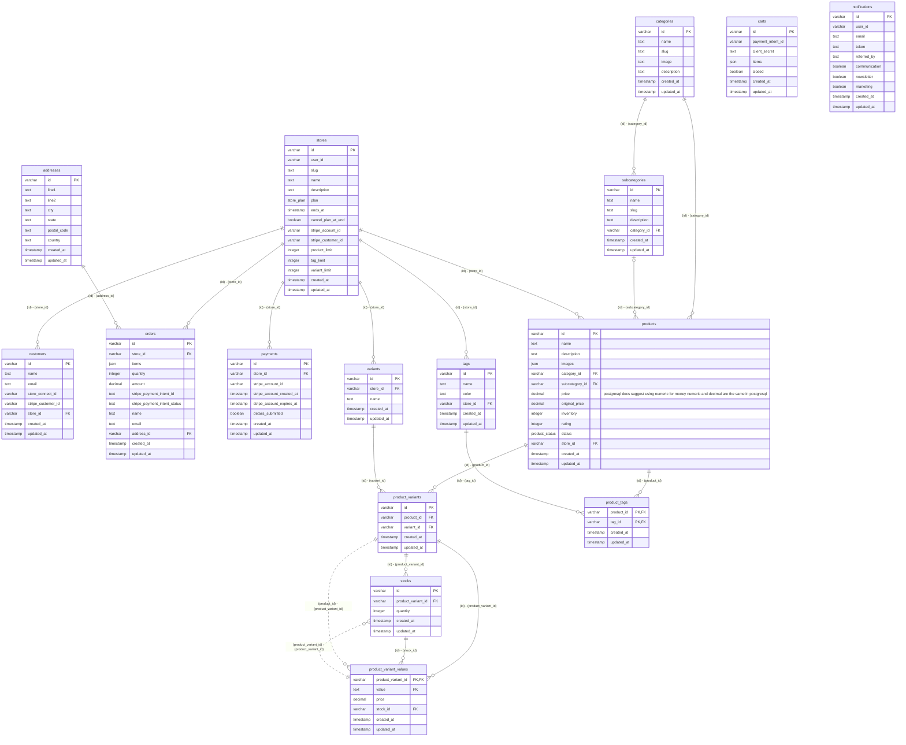

```mermaid
erDiagram
    stores ||--o{ customers : "(id) - (store_id)"
    stores ||--o{ orders : "(id) - (store_id)"
    addresses ||--o{ orders : "(id) - (address_id)"
    stores ||--o{ payments : "(id) - (store_id)"
    categories ||--o{ products : "(id) - (category_id)"
    subcategories |o--o{ products : "(id) - (subcategory_id)"
    stores ||--o{ products : "(id) - (store_id)"
    product_variants ||--o{ stocks : "(id) - (product_variant_id)"
    categories ||--o{ subcategories : "(id) - (category_id)"
    stores ||--o{ tags : "(id) - (store_id)"
    products ||--o{ product_tags : "(id) - (product_id)"
    tags ||--o{ product_tags : "(id) - (tag_id)"
    stores ||--o{ variants : "(id) - (store_id)"
    products ||--o{ product_variants : "(id) - (product_id)"
    variants ||--o{ product_variants : "(id) - (variant_id)"
    product_variants ||--o{ product_variant_values : "(id) - (product_variant_id)"
    stocks ||--o{ product_variant_values : "(id) - (stock_id)"
    product_variant_values ||..o{ stocks : "(product_variant_id) - (product_variant_id)"
    product_variants ||..o{ product_variant_values : "(product_id) - (product_variant_id)"
    addresses {
        varchar id PK
        text line1
        text line2
        text city
        text state
        text postal_code
        text country
        timestamp created_at
        timestamp updated_at
    }
    carts {
        varchar id PK
        varchar payment_intent_id
        text client_secret
        json items
        boolean closed
        timestamp created_at
        timestamp updated_at
    }
    categories {
        varchar id PK
        text name
        text slug
        text image
        text description
        timestamp created_at
        timestamp updated_at
    }
    customers {
        varchar id PK
        text name
        text email
        varchar store_connect_id
        varchar stripe_customer_id
        varchar store_id FK
        timestamp created_at
        timestamp updated_at
    }
    notifications {
        varchar id PK
        varchar user_id
        text email
        text token
        text referred_by
        boolean communication
        boolean newsletter
        boolean marketing
        timestamp created_at
        timestamp updated_at
    }
    orders {
        varchar id PK
        varchar store_id FK
        json items
        integer quantity
        decimal amount
        text stripe_payment_intent_id
        text stripe_payment_intent_status
        text name
        text email
        varchar address_id FK
        timestamp created_at
        timestamp updated_at
    }
    payments {
        varchar id PK
        varchar store_id FK
        varchar stripe_account_id
        timestamp stripe_account_created_at
        timestamp stripe_account_expires_at
        boolean details_submitted
        timestamp created_at
        timestamp updated_at
    }
    products {
        varchar id PK
        text name
        text description
        json images
        varchar category_id FK
        varchar subcategory_id FK
        decimal price "postgresql docs suggest using numeric for money numeric and decimal are the same in postgresql"
        decimal original_price
        integer inventory
        integer rating
        product_status status
        varchar store_id FK
        timestamp created_at
        timestamp updated_at
    }
    stocks {
        varchar id PK
        varchar product_variant_id FK
        integer quantity
        timestamp created_at
        timestamp updated_at
    }
    stores {
        varchar id PK
        varchar user_id
        text slug
        text name
        text description
        store_plan plan
        timestamp ends_at
        boolean cancel_plan_at_end
        varchar stripe_account_id
        varchar stripe_customer_id
        integer product_limit
        integer tag_limit
        integer variant_limit
        timestamp created_at
        timestamp updated_at
    }
    subcategories {
        varchar id PK
        text name
        text slug
        text description
        varchar category_id FK
        timestamp created_at
        timestamp updated_at
    }
    tags {
        varchar id PK
        text name
        text color
        varchar store_id FK
        timestamp created_at
        timestamp updated_at
    }
    product_tags {
        varchar product_id PK, FK
        varchar tag_id PK, FK
        timestamp created_at
        timestamp updated_at
    }
    variants {
        varchar id PK
        varchar store_id FK
        text name
        timestamp created_at
        timestamp updated_at
    }
    product_variants {
        varchar id PK
        varchar product_id FK
        varchar variant_id FK
        timestamp created_at
        timestamp updated_at
    }
    product_variant_values {
        varchar product_variant_id PK, FK
        text value PK
        decimal price
        varchar stock_id FK
        timestamp created_at
        timestamp updated_at
    }
```
