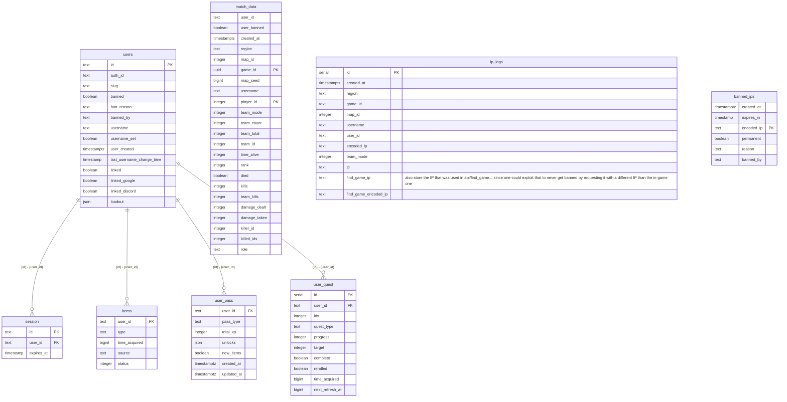

```mermaid
erDiagram
    users ||--o{ session : "(id) - (user_id)"
    users ||--o{ items : "(id) - (user_id)"
    users ||--o{ user_pass : "(id) - (user_id)"
    users ||--o{ user_quest : "(id) - (user_id)"
    session {
        text id PK
        text user_id FK
        timestamp expires_at
    }
    users {
        text id PK
        text auth_id
        text slug
        boolean banned
        text ban_reason
        text banned_by
        text username
        boolean username_set
        timestamptz user_created
        timestamp last_username_change_time
        boolean linked
        boolean linked_google
        boolean linked_discord
        json loadout
    }
    items {
        text user_id FK
        text type
        bigint time_acquired
        text source
        integer status
    }
    user_pass {
        text user_id FK
        text pass_type
        integer total_xp
        json unlocks
        boolean new_items
        timestamptz created_at
        timestamptz updated_at
    }
    user_quest {
        serial id PK
        text user_id FK
        integer idx
        text quest_type
        integer progress
        integer target
        boolean complete
        boolean rerolled
        bigint time_acquired
        bigint next_refresh_at
    }
    match_data {
        text user_id
        boolean user_banned
        timestamptz created_at
        text region
        integer map_id
        uuid game_id PK
        bigint map_seed
        text username
        integer player_id PK
        integer team_mode
        integer team_count
        integer team_total
        integer team_id
        integer time_alive
        integer rank
        boolean died
        integer kills
        integer team_kills
        integer damage_dealt
        integer damage_taken
        integer killer_id
        integer killed_ids
        text role
    }
    ip_logs {
        serial id PK
        timestamptz created_at
        text region
        text game_id
        integer map_id
        text username
        text user_id
        text encoded_ip
        integer team_mode
        text ip
        text find_game_ip "also store the IP that was used in api/find_game... since one could exploit that to never get banned by requesting it with a different IP than the in-game one"
        text find_game_encoded_ip
    }
    banned_ips {
        timestamptz created_at
        timestamp expires_in
        text encoded_ip PK
        boolean permanent
        text reason
        text banned_by
    }
```
