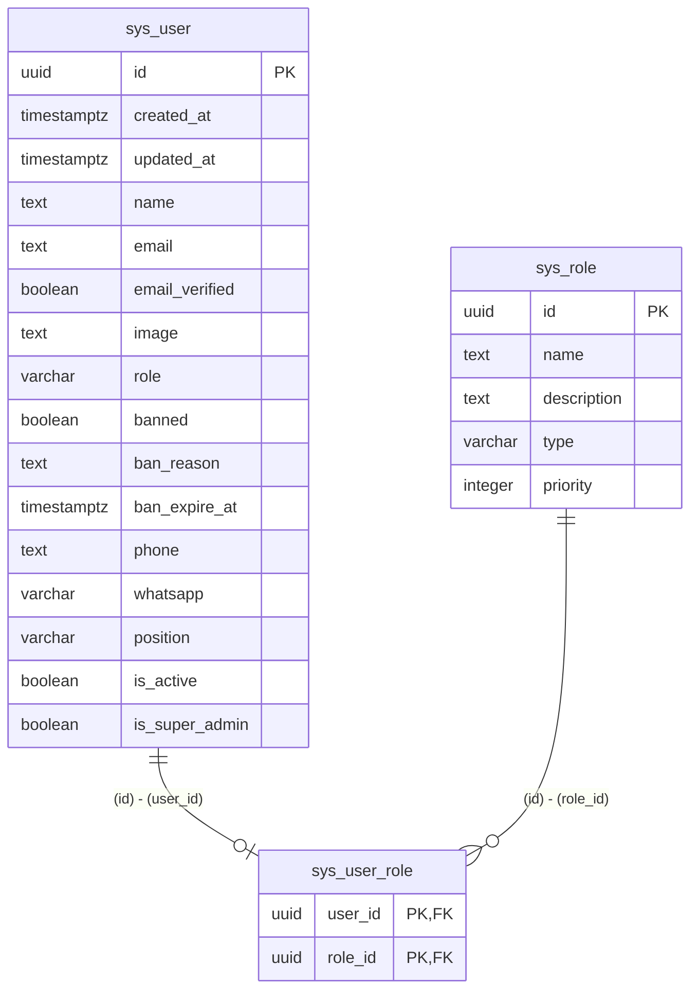

```mermaid
erDiagram
    sys_user ||--o| sys_user_role : "(id) - (user_id)"
    sys_role ||--o{ sys_user_role : "(id) - (role_id)"
    sys_user {
        uuid id PK
        timestamptz created_at
        timestamptz updated_at
        text name
        text email
        boolean email_verified
        text image
        varchar role
        boolean banned
        text ban_reason
        timestamptz ban_expire_at
        text phone
        varchar whatsapp
        varchar position
        boolean is_active
        boolean is_super_admin
    }
    sys_role {
        uuid id PK
        text name
        text description
        varchar type
        integer priority
    }
    sys_user_role {
        uuid user_id PK, FK
        uuid role_id PK, FK
    }
```
