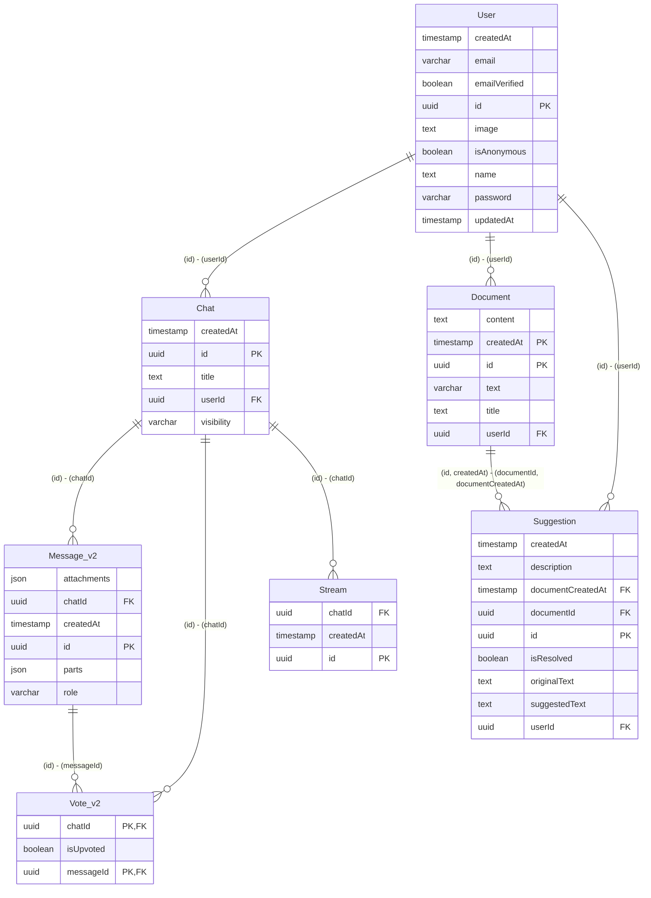

```mermaid
erDiagram
    User ||--o{ Chat : "(id) - (userId)"
    Chat ||--o{ Message_v2 : "(id) - (chatId)"
    Chat ||--o{ Vote_v2 : "(id) - (chatId)"
    Message_v2 ||--o{ Vote_v2 : "(id) - (messageId)"
    User ||--o{ Document : "(id) - (userId)"
    User ||--o{ Suggestion : "(id) - (userId)"
    Document ||--o{ Suggestion : "(id, createdAt) - (documentId, documentCreatedAt)"
    Chat ||--o{ Stream : "(id) - (chatId)"
    User {
        timestamp createdAt
        varchar email
        boolean emailVerified
        uuid id PK
        text image
        boolean isAnonymous
        text name
        varchar password
        timestamp updatedAt
    }
    Chat {
        timestamp createdAt
        uuid id PK
        text title
        uuid userId FK
        varchar visibility
    }
    Message_v2 {
        json attachments
        uuid chatId FK
        timestamp createdAt
        uuid id PK
        json parts
        varchar role
    }
    Vote_v2 {
        uuid chatId PK, FK
        boolean isUpvoted
        uuid messageId PK, FK
    }
    Document {
        text content
        timestamp createdAt PK
        uuid id PK
        varchar text
        text title
        uuid userId FK
    }
    Suggestion {
        timestamp createdAt
        text description
        timestamp documentCreatedAt FK
        uuid documentId FK
        uuid id PK
        boolean isResolved
        text originalText
        text suggestedText
        uuid userId FK
    }
    Stream {
        uuid chatId FK
        timestamp createdAt
        uuid id PK
    }
```
