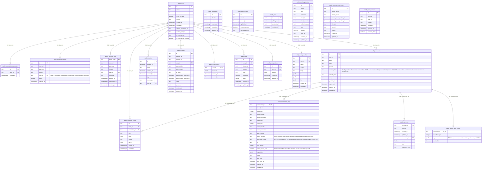

```mermaid
erDiagram
    mail0_user ||--o{ mail0_assistant_conversation : "(id) - (user_id)"
    mail0_user |o--o{ mail0_assistant_identity : "(id) - (user_id)"
    mail0_user |o--o{ mail0_assistant_link : "(id) - (user_id)"
    mail0_user ||--o{ mail0_assistant_action : "(id) - (user_id)"
    mail0_connection ||--o{ mail0_assistant_action : "(id) - (connection_id)"
    mail0_user ||--o{ mail0_session : "(id) - (user_id)"
    mail0_user ||--o{ mail0_account : "(id) - (user_id)"
    mail0_user ||--o| mail0_user_hotkeys : "(id) - (user_id)"
    mail0_user ||--o{ mail0_connection : "(id) - (user_id)"
    mail0_connection ||--o| mail0_connection_imap : "(id) - (connection_id)"
    mail0_connection ||--o{ mail0_summary : "(id) - (connection_id)"
    mail0_user ||--o{ mail0_note : "(id) - (user_id)"
    mail0_user ||--o| mail0_user_settings : "(id) - (user_id)"
    mail0_connection ||--o| mail0_writing_style_matrix : "(id) - (connectionId)"
    mail0_user ||--o{ mail0_email_template : "(id) - (user_id)"
    mail0_user {
        text id PK
        text name
        text email
        boolean email_verified
        text image
        timestamp created_at
        timestamp updated_at
        text default_connection_id
        text custom_prompt
        text phone_number
        boolean phone_number_verified
    }
    mail0_assistant_conversation {
        text id PK
        text user_id FK
        timestamptz created_at
    }
    mail0_assistant_identity {
        text id PK
        text channel
        text gateway
        text sender
        text user_id FK "Retain a tombstone after deletion: never reuse another person's transcript."
        boolean active
        timestamptz created_at
    }
    mail0_assistant_link {
        text token_hash PK
        text channel
        text gateway
        text sender
        text user_id FK
        text challenge
        timestamptz expires_at
        timestamptz consumed_at
        timestamptz created_at
    }
    mail0_assistant_action {
        text id PK
        text user_id FK
        text connection_id FK
        text tool
        jsonb input
        text status
        jsonb result
        timestamptz expires_at
        timestamptz created_at
    }
    mail0_session {
        text id PK
        timestamp expires_at
        text token
        timestamp created_at
        timestamp updated_at
        text ip_address
        text user_agent
        text user_id FK
    }
    mail0_account {
        text id PK
        text account_id
        text provider_id
        text user_id FK
        text access_token
        text refresh_token
        text id_token
        timestamp access_token_expires_at
        timestamp refresh_token_expires_at
        text scope
        text password
        timestamp created_at
        timestamp updated_at
    }
    mail0_user_hotkeys {
        text user_id PK, FK
        jsonb shortcuts
        timestamp created_at
        timestamp updated_at
    }
    mail0_verification {
        text id PK
        text identifier
        text value
        timestamp expires_at
        timestamp created_at
        timestamp updated_at
    }
    mail0_early_access {
        text id PK
        text email
        timestamp created_at
        timestamp updated_at
        boolean is_early_access
        text has_used_ticket
    }
    mail0_connection {
        text id PK
        text user_id FK
        text email
        text name
        text picture
        text access_token "OAuth providers: the provider access token. IMAP: a non-secret marker (password auth) or the XOAUTH2 access token. `null` means the connection must be reauthorized."
        text refresh_token
        text scope
        text provider_id
        timestamp expires_at
        timestamp created_at
        timestamp updated_at
    }
    mail0_connection_imap {
        text connection_id PK, FK
        text imap_host
        integer imap_port
        text imap_security
        text imap_username
        text smtp_host
        integer smtp_port
        text smtp_security
        text smtp_username
        text auth_method
        text oauth_provider "XOAUTH2 only: which OAuth provider issued the tokens (used for refresh)."
        text encrypted_secret "AES-GCM ciphertext of the password (password auth) or refresh token (XOAUTH2)."
        text iv
        integer key_version
        boolean server_saves_sent "Whether the SMTP server files sent mail into the Sent folder by itself."
        jsonb capabilities
        text status
        text last_error
        timestamp last_sync_at
        timestamp created_at
        timestamp updated_at
    }
    mail0_summary {
        text message_id PK
        text content
        timestamp created_at
        timestamp updated_at
        text connection_id FK
        boolean saved
        text tags
        text suggested_reply
    }
    mail0_note {
        text id PK
        text user_id FK
        text thread_id
        text content
        text color
        boolean is_pinned
        integer order
        timestamp created_at
        timestamp updated_at
    }
    mail0_user_settings {
        text id PK
        text user_id FK
        jsonb settings
        timestamp created_at
        timestamp updated_at
    }
    mail0_writing_style_matrix {
        text connectionId PK, FK
        integer numMessages
        jsonb style "TODO: way too much pain to get this type to work, revisit later"
        timestamp updatedAt
    }
    mail0_jwks {
        text id PK
        text public_key
        text private_key
        timestamp created_at
    }
    mail0_oauth_application {
        text id PK
        text name
        text icon
        text metadata
        text client_id
        text client_secret
        text redirect_u_r_ls
        text type
        boolean disabled
        text user_id
        timestamp created_at
        timestamp updated_at
    }
    mail0_oauth_access_token {
        text id PK
        text access_token
        text refresh_token
        timestamp access_token_expires_at
        timestamp refresh_token_expires_at
        text client_id
        text user_id
        text scopes
        timestamp created_at
        timestamp updated_at
    }
    mail0_oauth_consent {
        text id PK
        text client_id
        text user_id
        text scopes
        timestamp created_at
        timestamp updated_at
        boolean consent_given
    }
    mail0_email_template {
        text id PK
        text user_id FK
        text name
        text subject
        text body
        jsonb to
        jsonb cc
        jsonb bcc
        timestamp created_at
        timestamp updated_at
    }
```
