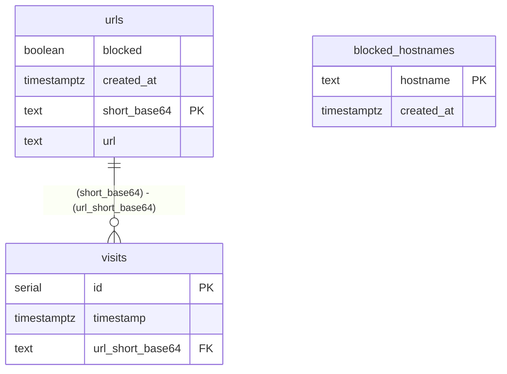

```mermaid
erDiagram
    urls ||--o{ visits : "(short_base64) - (url_short_base64)"
    blocked_hostnames {
        text hostname PK
        timestamptz created_at
    }
    urls {
        boolean blocked
        timestamptz created_at
        text short_base64 PK
        text url
    }
    visits {
        serial id PK
        timestamptz timestamp
        text url_short_base64 FK
    }
```
